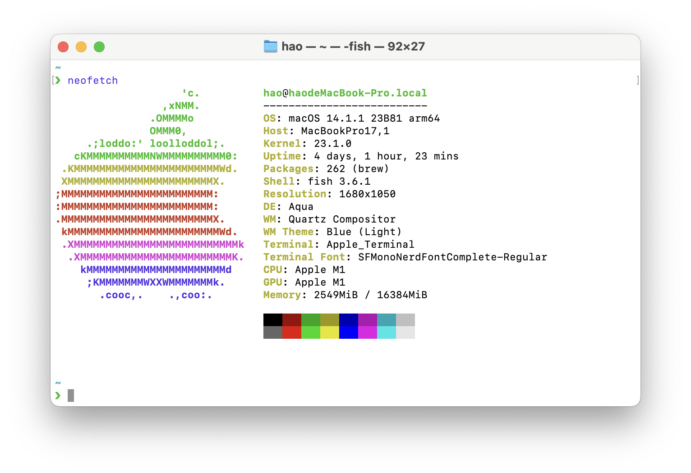
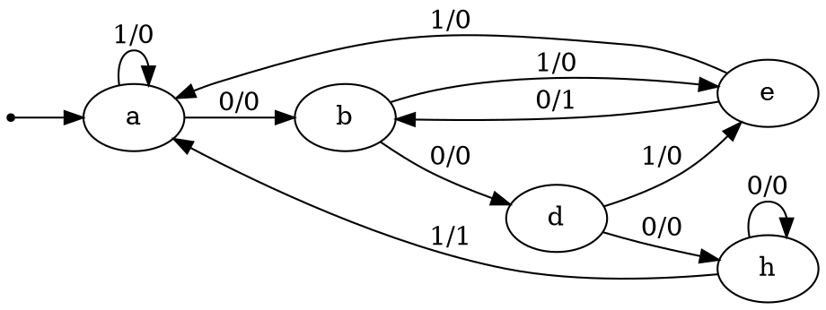
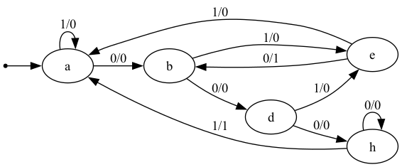

# CS2022301-State-Minimization
> 資訊工程系 二年級 乙班 張皓鈞 B11030202

## Requirements
- GNU GCC/Clang with C++14 supported
- CMake >= 3.18
- Make or Ninja build tool

> MSVC(Microsoft Visual C++) may be supported, but not tested

## Build

Use CMake to build the program

```bash
mkdir build
cd build
cmake -DCMAKE_BUILD_TYPE=Release ..
cmake --build .
```

## Usage

```
Usage: ./state_minimization <input_kiss> <output_kiss> <output_dot> [--debug]
```

## Example

```bash
./state_minimization ./input.kiss ./output.kiss ./output.dot
Success
```

## Test platform



### macOS

```
Darwin haodeMacBook-Pro.local 23.1.0 Darwin Kernel Version 23.1.0: Mon Oct  9 21:28:12 PDT 2023; root:xnu-10002.41.9~6/RELEASE_ARM64_T8103 arm64
```

### Apple Clang

```
Apple clang version 15.0.0 (clang-1500.0.40.1)
Target: arm64-apple-darwin23.1.0
Thread model: posix
InstalledDir: /Applications/Xcode.app/Contents/Developer/Toolchains/XcodeDefault.xctoolchain/usr/bin
```

### CMake

```
cmake version 3.26.4
```

### Ninja

```
1.11.1
```

### Graphviz dot

```
dot - graphviz version 9.0.0 (20230911.1827)
```

## Test case

[./examples/set00/case1/input.kiss](./examples/set00/case1/input.kiss)

### Input kiss

```kiss
.start_kiss
.i 1
.o 1
.p 14
.s 7
.r a
0 a b 0
1 a c 0
0 b d 0
1 b e 0
0 c f 0
1 c a 0
0 d h 0
1 d g 0
0 e b 1
1 e c 0
0 f d 0
1 f e 0
0 g f 1
1 g a 0
0 h h 0
1 h a 1
.end_kiss
```

### Output kiss

```kiss
.start_kiss
.i 1
.o 1
.p 10
.s 5
.r a
0 a b 0
1 a a 0
0 b d 0
1 b e 0
0 d h 0
1 d e 0
0 e b 1
1 e a 0
0 h h 0
1 h a 1
.end_kiss
```

### Output dot



### Output PNG


